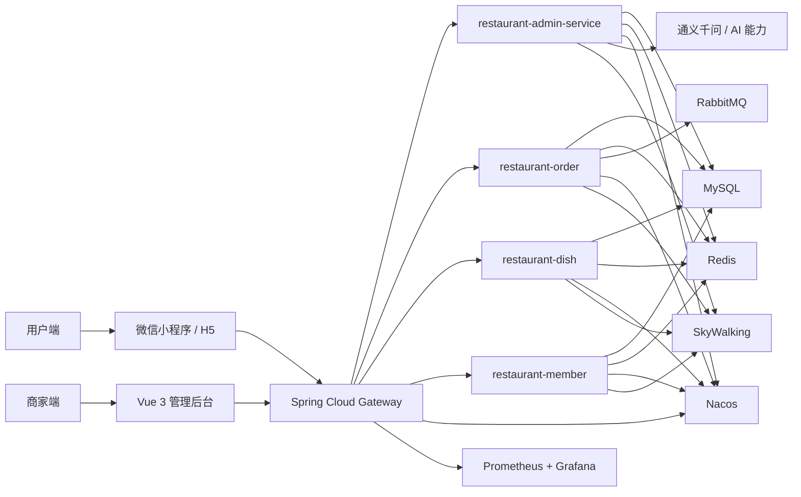
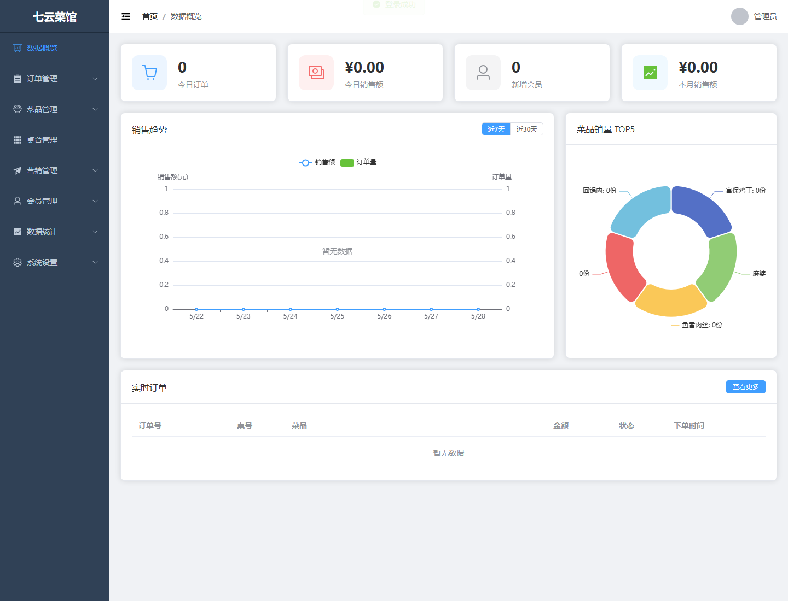
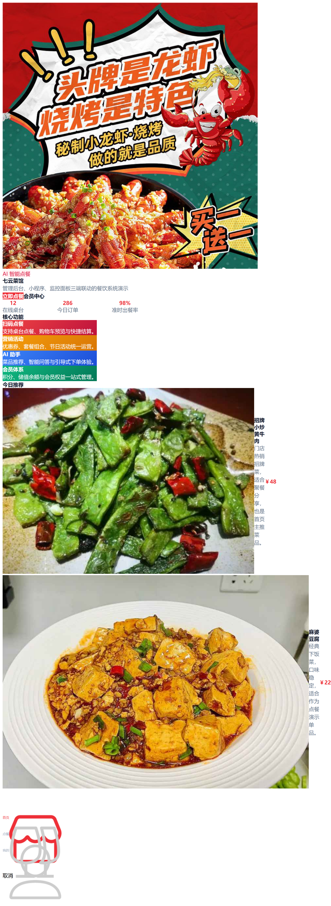

# 七云菜馆

面向餐饮场景的全栈微服务项目，包含管理后台、微信小程序/H5 客户端与后端服务集群，覆盖菜品管理、订单流转、会员体系、营销活动、监控观测与 AI 智能助手等核心业务能力。

## 项目概览

七云菜馆以餐饮业务中台为核心，基于 Spring Cloud 构建服务化后端，前台提供 uni-app 小程序/H5 点餐端，后台提供 Vue 3 商家管理系统。项目重点体现了微服务拆分、缓存优化、高并发下单、异步解耦、监控链路与多端交付能力，适合作为求职作品集中的完整实战项目展示。

## 核心亮点

- 微服务架构：按网关、订单、菜品、会员、管理等职责拆分服务，使用 Nacos 完成注册发现与配置协同。
- 高并发处理：基于 Redis + Lua 实现库存扣减与一人一单校验，降低超卖风险并保证关键链路一致性。
- 异步解耦：利用 RabbitMQ 承接订单消息与业务解耦，提升下单链路吞吐能力。
- 缓存体系：采用 Caffeine + Redis 二级缓存，并结合逻辑过期、布隆过滤器、随机过期时间处理缓存击穿、穿透与雪崩问题。
- 多端交付：同时交付 Vue 3 管理后台与 uni-app 微信小程序/H5 客户端，完整体现 B 端 + C 端配套能力。
- 可观测性：接入 Prometheus、Grafana、SkyWalking，支持服务监控、链路追踪与性能定位。
- AI 能力：集成通义千问模型，支持菜品推荐、问答交互与智能辅助体验。

## 技术栈

### 后端

- Spring Boot
- Spring Cloud
- Spring Cloud Alibaba
- Nacos
- MyBatis-Plus
- MySQL
- Redis
- RabbitMQ
- ShardingSphere
- Sentinel
- Docker

### 前端

- Vue 3
- Element Plus
- uni-app
- 微信小程序

### 监控与运维

- Prometheus
- Grafana
- SkyWalking

## 项目结构

```text
F:\HBuilderProjects
├── restaurant-gateway                     # API 网关
├── restaurant-order                       # 订单服务
├── restaurant-dish                        # 菜品服务
├── restaurant-member                      # 会员服务
├── restaurant-admin-service               # 管理端后端服务
├── restaurant-admin                       # 商家管理后台前端
├── restaurant-server                      # Docker / 中间件 / 监控部署配置
└── 私房菜点餐项目前端模版（微信小程序+H5）    # uni-app 小程序与 H5 客户端
```

## 系统架构图



## 业务能力

### 用户端

- 微信小程序点餐
- H5 点餐与下单
- 购物车与结算流程
- 会员中心
- 优惠券与积分体系
- AI 智能点餐助手

### 管理端

- 数据概览看板
- 菜品与分类管理
- 订单管理与实时订单查看
- 桌台管理
- 营销活动管理
- 会员管理

### 平台能力

- 服务网关与统一鉴权
- 缓存加速与热点保护
- 异步消息削峰解耦
- 分布式事务兜底
- 监控告警与链路追踪

## 界面预览

### 管理后台



### 微信小程序



## 本地启动

### 环境要求

- JDK 17+
- Maven 3.8+
- Node.js 18+
- MySQL 8.0+
- Redis
- RabbitMQ
- Docker Desktop

### 后端服务

1. 启动 MySQL、Redis、RabbitMQ、Nacos 等依赖服务。
2. 启动 `restaurant-gateway`、`restaurant-order`、`restaurant-dish`、`restaurant-member`、`restaurant-admin-service`。
3. 管理后台前端默认访问地址：`http://localhost:8090` 或本地开发端口。

### 小程序 / H5

1. 打开 `私房菜点餐项目前端模版（微信小程序+H5）` 目录。
2. 安装依赖并运行对应平台产物。
3. 微信小程序通过 `dist/build/mp-weixin` 导入微信开发者工具。

## 展示建议

如果用于简历或面试展示，建议重点突出以下内容：

- 微服务拆分与服务协作设计
- Redis / RabbitMQ / Sentinel 等中间件落地经验
- 缓存优化、高并发控制与最终一致性方案
- 管理后台 + 小程序 + 监控体系的完整交付能力

## License

MIT
